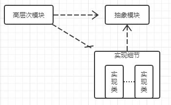

##### 依赖倒置原则(DIP)

**依赖反转原则**（Dependency inversion principle，DIP）是指一种特定的[解耦](https://zh.wikipedia.org/wiki/耦合性_(計算機科學))（传统的[依赖](https://zh.wikipedia.org/wiki/耦合性_(計算機科學))关系创建在高层次上，而具体的策略设置则应用在低层次的模块上）形式，**使得高层次的模块不依赖于低层次的模块的实现细节，依赖关系被颠倒（反转），从而使得低层次模块依赖于高层次模块的需求抽象。**

**图1中，高层对象A依赖于底层对象B的实现；图2中，把高层对象A对底层对象的需求抽象为一个接口A，底层对象B实现了接口A，这就是依赖反转。**

该原则规定：

1. 高层次的模块(稳定)不应该依赖于低层次的模块(**低层实现细节是变化的**)，两者都应该依赖于[抽象接口](https://zh.wikipedia.org/wiki/抽象化_(計算機科學))。(稳定)
2. 抽象接口不应该依赖于具体实现。而具体实现则应该依赖于抽象接口。

> 具体实现时变化的，如果高层次模块模块或者抽象模块依赖于具体实现，系统就会变的不稳定。依赖倒置原则可以把实现细节隔离。

##### 开放封闭原则（OCP）

- 对扩展开放，对更改封闭。
- 类模块应该是可扩展的，但是不可修改。

##### 单一职责原则（SRP）

**单一功能(职责)原则**（Single responsibility principle）规定每个类都应该有一个单一的功能，并且该功能应该由这个类完全封装起来。

- 一个类应该仅有一个引起它变化的原因。
- 变化的方向隐含着类的责任。

##### Liskov 替换原则(LSP)

- 子类必须能够替换它们的基类(IS-A)。
- 继承表达类型抽象。

##### 接口隔离原则(ISP)

**接口隔离原则**（英语：interface-segregation principles， 缩写：ISP）指明客户（client）应该不依赖于它不使用的方法。接口隔离原则(ISP)拆分非常庞大臃肿的接口成为更小的和更具体的接口，这样客户将会只需要知道他们感兴趣的方法。这种缩小的接口也被称为**角色接口**（role interfaces）。接口隔离原则(ISP)的目的是系统解开耦合，从而容易重构，更改和重新部署。

- 不应该强迫客户程序依赖它们不用的方法。
- 接口应该小而完备。

>在[程序设计](https://zh.wikipedia.org/wiki/程序设计)领域， **SOLID**（**单一功能、开闭原则、里氏替换、接口隔离**以及**依赖反转**）是由[罗伯特·C·马丁](https://zh.wikipedia.org/w/index.php?title=Robert_C._Martin&action=edit&redlink=1)在21世纪早期[[1\]](https://zh.wikipedia.org/wiki/SOLID_(面向对象设计)#cite_note-metz-presentation-2009-1) 引入的[记忆术](https://zh.wikipedia.org/wiki/记忆术)[首字母缩略字](https://zh.wikipedia.org/wiki/首字母缩略字)[[2\]](https://zh.wikipedia.org/wiki/SOLID_(面向对象设计)#cite_note-ub-old-web-solid-2)[[3\]](https://zh.wikipedia.org/wiki/SOLID_(面向对象设计)#cite_note-ub-solid-3)，指代了[面向对象编程](https://zh.wikipedia.org/wiki/面向对象编程)和[面向对象设计](https://zh.wikipedia.org/wiki/面向对象设计)的五个基本原则。

##### 组合/聚合复用原则（Composite/Aggregate Reuse Principle CARP）

优先使用对象组合，而不是类继承

- 类继承通常为“白箱复用”，对象组合通常为“黑箱复用” 。

- 继承在某种程度上破坏了封装性，子类父类耦合度高。

- 而对象组合则只要求被组合的对象具有良好定义的接口，耦合度低。

  

***

1. 封装变化点

- 使用封装来创建对象之间的分界层，让设计者可以在分界层的一侧进行修改，而不会对另一侧产生不良的影响，从而实现层次间的松耦合。

2. 针对接口编程，而不是针对实现编程

- 不将变量类型声明为某个特定的具体类，而是声明为某个接口。
- 客户程序无需获知对象的具体类型，只需要知道对象所具有的接口。
- 减少系统中各部分的依赖关系，从而实现“高内聚、松耦合”的类型设计方案。

***

将设计原则提升为设计经验

1. 设计习语 Design Idioms

   Design Idioms 描述与特定编程语言相关的低层模式，技巧、惯用法

2. 设计模式 Design pattern

   Design pattern 主要描述的是类与相互通信的对象之间的组织关系，包括它们的角色、职责、协作方式等

3. 架构模式 Architectural pattern

   Architectural pattern描述的是系统中与基本机构组织关系密切的高层模式，包括子系统划分，职责，以及如何组织它们自己的关系的规则

> 重构获得模式

