#### Office判题数据流图

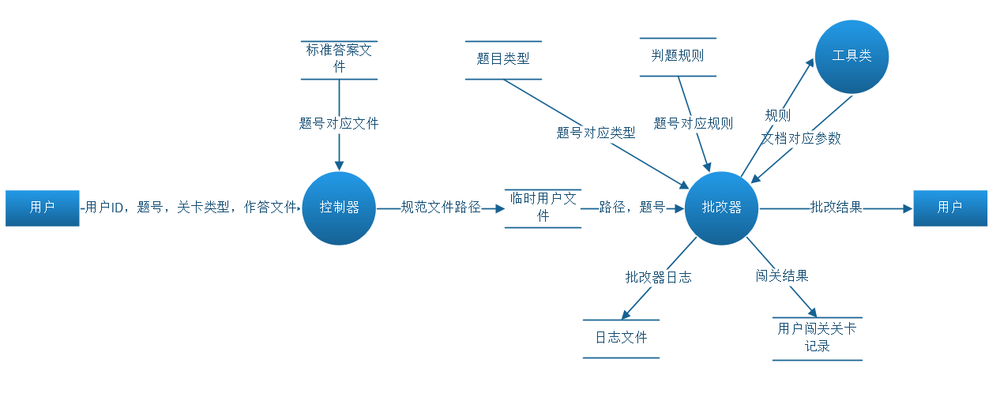

> 用户作答完毕上传作答文件和相关信息给判题控制器，控制器接收用户上传的参数和文件并获取对应题号的标准答案文件。获取答案文档后，将用户上传的作答文件和标准答案文档一同存储到临时目录。当控制器判断满足判题的条件后向批改器发起批改消息。批改器收到批改消息后，先获取对应题目的判题规则或者规则数组，然后调用具体的工具类解析规则进行判题并返回批改结果。


#### 控制器

控制器主要用于接收各类题目的作答文件，并向判题器发送判题消息，控制器包含有以下接口，接口的详细信息请查看接口文档。

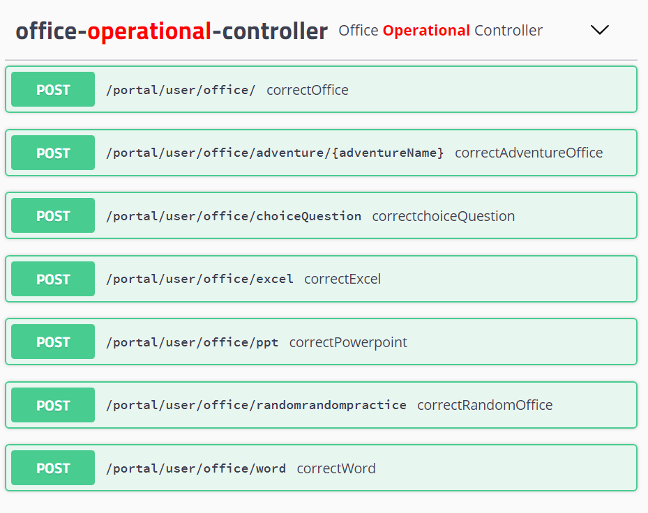

#### 判题器

判题器的类图如下

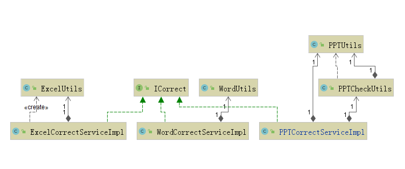

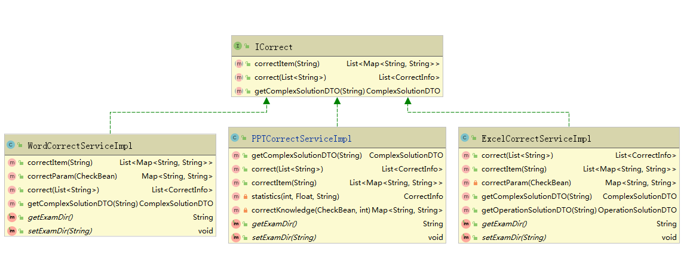


ICorrect为 Word/Excel/PPT单道大题的批改接口,ExcelCorrectServiceImpl、WordCorrectSErviceImpl、PPTCorrectServiceImpl为具体实现接口。其中主要方法如下:

* `correct(List<jString> correctJson)` 方法用于根据题目json规则数组判分
* `correctItem(String rule)` 方法用于根据每一道小题的规则判分
* `getComplexSolutionDTO(String num)`根据大题号返回操作题相关信息类（包括操作题类型，题目资源链接，题目规则）

#### 判题规则

##### 判题的形式化方案

判题的形式化方案描述如下图

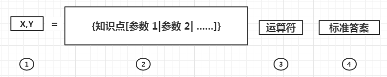


其中,①部分表示的是知识点X和该知识点的总分数值Y。②、③、④部分共同组成一个布尔型的数学表达式**（知识点参数与标准答案进行比较，大部分运算为等值运算）**,当表达式的结果为“真”时,该知识点的参数得分,否则不得分。②部分详细地描述了知识点的类别和该知识点的参数信息,规则解析首先分析该部分的内容,并根据参数从学生作答文档中获取指定的信息，即学生对该知识点的操作结果信息,然后再与④部分给定的标准进行指定运算。

> 每个知识点有多个参数，知识点得分公式如下：
> $$
> Score =\sum_{i=1}^{n}score_{i}            
> $$
>
> $$
> score_{i}  \subseteq \left \{   \frac{Y}{n} ,0 \right \}
> $$
>
> 其中Score为一个知识点（对应一条规则）的总得分，n为这个知识点参数的个数，Y为这个知识点的总分值，$$\frac{Y}{n}$$为每个参数的的分值。$$score_{i}$$为第i个参数的得分情况。  


假为第一段“企业质量管理浅析”应用样式“标題1”，如何判断对应位置的样式,可以用以下方法进行形式化描述

```
location_S = “企业质量管理浅析”

Doc.段落(第一段).字符串(location_S).样式=“标题1”
```

先通过**定位**被操作段落,确定具体位置所在,进行数值比较,正确即得分。如何定位文档属性？

##### 文档属性的定位（属性的获取）

1. excel文档属性信息的定位

   在excel中，属性的定位路径有： `表[.单元格[.字符串]].属性`

2. word文档属性信息的定位

   在word和ppt需要定位的属性比较复杂，需要结合知识点进行定位。在word中对字符串、页、段落的属性定位有：`页[.段落[.字符串]].属性`；对于元素有`页眉[.段落.[.字符串]].属性`，表格有`表格[.[行[.列]]].属性`

3. ppt文档属性信息的定位

   在PPT中，主要由各种元素(文本框等、幻灯片等)组成。其定位有`	页码[.位置[.元素[.段落[.字符串]]]].属性`
   
   其中[]表示可能存在的路径,[]里面的部分可以没有。这里定义Location类如下：
   
   ```java
   /**
    * 静态内部类
    * 定位类 Location
    * 定位成员变量 lp,ls,lg,lr
    * 在excel中，lp定位表，ls在lp的基础上定位单元格，lo代表不取行(1,3,67,1)
    * lg不取列(1,3,67,1)
    * 在word中，lp定位段落，ls定位字符串；在表格中lp定位行，ls定位列；lo定位元素(header,table,paragraph)
    * 在ppt中，lp定位幻灯片页码，ls 定位元素位置（所有对象解析后根据在幻灯片中的位置会被存入一个数组中），
    * lo定位元素（如幻灯片、文本框等），lg定位段落，lr定位某串字符
    * @author livejq
    * @date 2019/7/23
    */
   @ToString()
   public class Location {
       /** 定位属性 */
       @Getter
       @Setter
       private String lp,ls,lo,lg,lr;
   }
   ```
   
   程序里面先通过获取Location的属性，然后通过Utils类里面的get方法获取对应的文档对象。这里获取文档对象的主要方法是通过判断某个文档元素对象(段落、表格、字符串等)是否包含有定位对象Location类属性中的对应关键字的值。如果包含则返回这个对象元素。当然还有其他获取方法，如获取表格中的某个单元格可以先获取包含关键字的表格后，然后在根据Location中lp,ls指定的行和列获取对应的表格。
   
   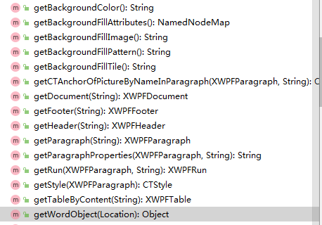

##### 规则的定义

这里使用*JSON*(JavaScript Object Notation)格式定义规则格式，主要属性有分值(score)、知识点(knowledge)、知识点参数(param)，和定位参数(location)以及文档文件名(baseFile)。其中下图中标有required的为必须属性。其中param(key/value)参数中的键(key)应该根据知识点的不同而不同，而param中的值(value)为该属性的正确值，也就是标准答案。当param中的value不是标准答案而是一个定位对象（location）时，应该根据Location重新找到文档中的标准答案，重新取到标准答案后一般是进行等值比较，如果是非等值比较可以添加一个运算符属性指定其他比较类型。

一个简单的JSON格式规则如下：

```json
{
  "score": "value",
  "knowledge": "value",
  "param": {
    "attribute1": "value",
    "attribute2": "value",
    "attribute3":  {
      "location": {
        "lp": "value",
        "ls": "0",
        "lr": "0",
        "lo": "value"
      }
    }
  },
  "location": {
    "lp": "value",
    "ls": "0",
    "lr": "0",
    "lo": "value"
  },
  "baseFile": "Word.docx"
}
```


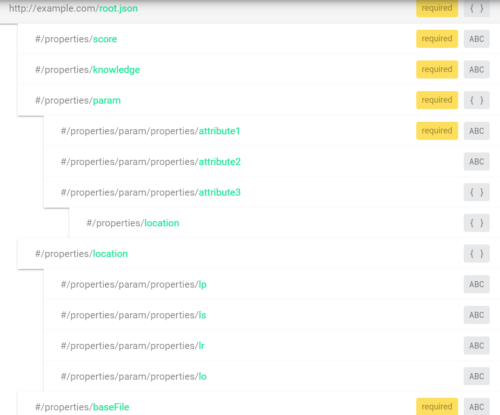

判题JSON格式的Schema 约束如下：

```json
{
       "definitions": {},
       "$schema": "http://json-schema.org/draft-07/schema#",
       "$id": "http://example.com/root.json", 
       "type": "object",
       "title": "JSON 判题规则",
       "required": [
         "score",
         "knowledge",
         "param",
         "baseFile"
      ],
      "properties": {
        "score": {
          "$id": "#/properties/score",
          "type": "string",
          "title": "分值",
          "pattern": "^[1-9]\\d*\\.[0-9]{1}"

        },
        "knowledge": {
          "$id": "#/properties/knowledge",  
          "type": "string",
          "title": "知识点编号"
        },
        "param": {
          "$id": "#/properties/param",
          "type": "object",
          "title": "知识点参数对象",
          "required": [
                    "attribute1"
                  ],
          "properties": {
            "attribute1": {
              "$id": "#/properties/param/properties/attribute1",
              "type": "string",
              "title": "属性值"
            },
            "attribute2": {
              "$id": "#/properties/param/properties/attribute2",
              "type": "string",
              "title": "属性值"
            },
            "attribute3": {
                "$id": "#/properties/param/properties/attribute3",
                "type": "object",
                "title": "The Attribute3 Schema",
                "properties": {
                  "location": {
                    "$id": "#/properties/location",
                    "type": "object",
                    "title": "定位对象"
                  }
                }
              }            
          }
        },
        "location": {
         "$id": "#/properties/location",  
          "type": "object",
          "title": "定位元素对象",
          "properties": {
            "lp": {
              "$id": "#/properties/param/properties/lp",
              "type": "string",
              "title": "定位参数"
            },
            "ls": {
              "$id": "#/properties/param/properties/ls",
              "type": "string",
              "title": "定位参数"
            },
            "lr": {
            "$id": "#/properties/param/properties/lr",
            "type": "string",
             "title": "定位参数"
           },
           "lo": {
            "$id": "#/properties/param/properties/lo",
             "type": "string",
             "title": "定位参数"
           }
         }
       },
       "baseFile": {
        "$id": "#/properties/baseFile",  
         "type": "string",
         "title": "文档文件名"
       }
     }
   }
```

JSON Schema用于规范规则格式，根据知识点（knowledge）的不同其schema也应有所不同。其中`type`关键字指定JSON数据的基本数据类型，`title`关键字用来描述这个字段。`properties`指定JSON对象中的各种不同key和应该满足的校验逻辑。``pattern`关键字待校验JSON元素符合该关键字指定的正则表达式，才算通过校验。required`这个关键字是数组，数组中的元素必须是字符串，必须是唯一的。更多JSON Schema规范请参考[Specification | JSON Schema](http://json-schema.org/specification.html)。JSON Schem可借助网站[JSON Schema Tool](https://jsonschema.net/)进行编写和查看 。

Json规则对应的Pojo类CheckBean如下,一个CheckBean实例对应一个知识点规则。

```java
package org.gzmtu.monster.common;
import lombok.Getter;
import lombok.Setter;
import lombok.ToString;
import java.util.Map;

/**
 * @author MXDC
 * @date 2019/7/10
 **/
@Getter
@Setter
@ToString()
public class CheckBean{
    /** 规则编号 */
    private String knowledge;
    /** 定位对象 */
    private Location location;
    /** 参数集合 */
    private Map<String ,Object> param;
    /** 得分 */
    private String score;
    /** 基础操作文档 */
    private String baseFile;

}
```


##### 知识点的定义

这里我们将需要操作到的文档元素属性定义成枚举类，而枚举类中的常量就是对应元素的属性值。枚举类定义在`org.gzmtu.monster.common.office.excel`、`org.gzmtu.monster.common.office.word`和``org.gzmtu.monster.common.office.ppt`包中。

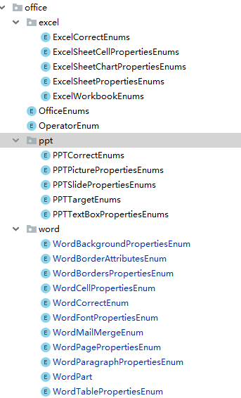

元素属性的封装如下例所示，必须定义属性ID和属性名称。

```java

/**
 * 封装word字体属性
 * @author srl
 * @date 2019/8/9
 */
@Getter
@AllArgsConstructor(access = AccessLevel.PRIVATE)
public enum WordFontPropertiesEnum {
    /** 字体大小 */
    FONT_SIZE(1,"文字大小"),
    /** 字体颜色 */
    FONT_COLOR(2,"文字颜色"),
    /** 字体 */
    FONT_FAMILY(3,"文字字体"),
    /** 加粗 */
    IS_BOLD(4,"加粗"),
    /** 斜体 */
    IS_ITALIC(5,"斜体"),
    /** 主题颜色 */
    THEME_COLOR(6,"主题颜色"),
    /** 文字宽度 */
    FIT_TEXT(7,"文字宽度");
    
    /** 属性id*/
    private Integer id;
    /** 属性名称*/
    private String property;
}
```

除了对属性的封装外，我们将要检查的属性也定义成枚举类(WordCorrectEnums、PPTCorrectEnums、ExcelCorrectEnums)。枚举类中的常量就是对应JSON规则中的knowledge，也可以说是规则的编码。knowledged的命名为“动词”+“文档属性枚举类中的常量名”。

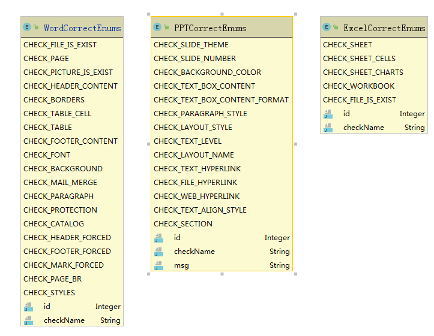

##### 判题规则中的比较运行(运算符)

通过JOSN规则中的location属性和param属性我们可以获取到要进行比较运算的操作数。大多数情况下是等值比较，也就是获取作答文档中的属性和标准答案进行等值比较，如果正确则给分。但是也存在一些非等值比较的情况。这里我们把运算符加到答案里面，也就是param参数中的值中，不加任何运算符的默认为等值比较。具体的比较运算我们通过OfficeGeneralUtils类实现。

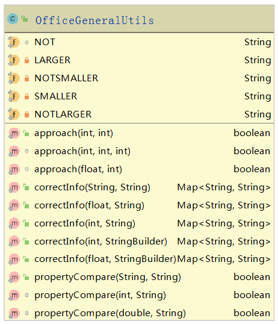

这里定义的运算符有非（NOT）、大于（LARGER）、不小于（NOTSMALLER）、小于（SMALLER）、不大于（NOTLARGER）。对于一些数值属性的获取可能存在误差，所有对数值的等值比较采用近似比较的方式，允许其存在一定的误差。

```java
/**
     * 判断数值近似度，误差值在3以内
     * @param value 获取学生提交文件的值
     * @param param 答案参考参数值
     * return 是否近似？true:false
     */
    public static boolean approach(int value, int param){
        //差值
        return Math.abs(value - param) < 3;
    }
```

#### 判题器的实现

实现了ICorrect接口的类具有批改题目的能力。其中主要方法如下:

- `correct(List<jString> correctJson)` 方法用于根据多道题目json**规则数组**判分

- `correctItem(String rule)` 方法用于根据每一道小题的规则判分

- `getComplexSolutionDTO(String num)`根据大题号返回操作题相关信息类（包括操作题类型，题目资源链接，题目规则）

  word判题器和Excel判题器及PPT判题器的实现大体是一致的，有较大区别的地方的话会另外说明。这里以word判题器的判决时序图为例。word判题器实现的时序图如下 :

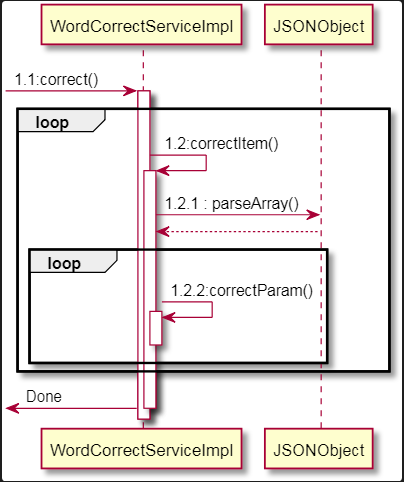

* 控制器向WordCorrectServiceImpl发送correct消息,WordCorrectServiceImple执行correct方法遍历**规则数组**个数并循环调用correctItem()方法对每一条规则数组进行判题。每一条规则数组中可能存在多个知识点规则，这时先调用JSONObject解析json数组成`List<CheckBean>`,然后在循环遍历CheckBean数组并调用CorrectParam()函数。
* correctParam(CheckBean checkBean)函数用于对单个知识点规则的批改。其实现的时序图如下:

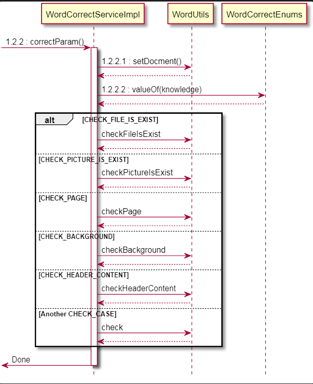

在执行correctParam时，先解析知识点规则中的baseFile属性，并判断WordUtils是否已经设置了baseFile对应的文档，如果没有则调用WordUtils的setDocmet()方法读取baseFile对应的文档并转化为word文档对象。然后获取要批改的knowledge，并通过WordCorrectEnums解析成枚举常量。最后进入switch结构中对应的case子句子中构调用WordUtils方法进行判题，并返回评分信息。WordUtils具体调用的check**()方法请查看文档手册。

* 评分信息

  评分信息通过调用OfficeGeneralUtils.correctInfo(totalScore,msg)返回。

  ```java
  /**
     	 * 评分详细信息
       * @param score 分数
       * @param info 评分信息
       * @return Map<String,Object>
       */
      public static Map<String,String> correctInfo(float score, StringBuilder info){
          return correctInfo(String.valueOf(score), info.toString());
      }
  ```

  > 判题器中的check方法集中写在Utils中，耦合度高，可重构改进。可在定义一个Check类接口，分离其中的check方法，面向接口编程减少耦合度，也方便拓展修改。

