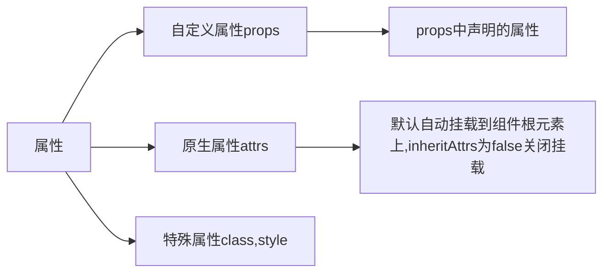
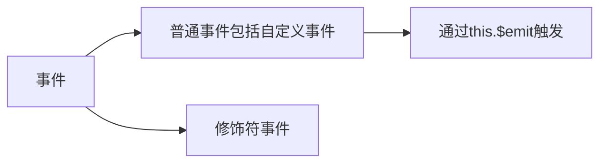

---
categories:
  - vue
---
#### 组件的组成——属性

子组件默认无法访问到父组件上的数据和方法。

有两种方法传递，分别为静态和动态`pros`

* 静态：<component-name propsname="hello world"></component-name>

* 动态：在使用(复用)子组件时，通过`v-bind:pmsg`="msg"，向子组件props中定义的`pmsg`传递父组件`data`中的`msg`数据。



```html
 <div id="app">
  <!-- 通过v-bind绑定自定义属性pmsg到msg -->
  <!-- 自定义属性pmgs在props数组中定义才可以在子组件中使用 -->
    <com1 v-bind:pmsg="msg"></com1>
 </div>

<script>
  
    var v =new Vue({
        el:'#app',
        data:{
            msg:"hello world"
        },
       components:{
            
           com1:{
               template:'<h1>jjjj{{pmsg}}---{{cmsg}}</h1>',
            //    需要定义才能使用，只读
               props:['pmsg'],
               data() {
               return {
                   cmsg:"aaaaa"
               }
           },
           }
       }
    })
</script>
```

> 组件中props中定义的属性的数据都是父组件传递过来的，传递过来的数据是只读单向的，自己修改会报错，可以通过调用父组件传递过的函数修改

#### 组件的组成——事件



普通事件通过`@chang`、`@input`、`@click`、`@customEvnet`绑定事件，通过`this.$emit('EventName',param...)`触发，其中@input是`v-on:input`的缩写

#### 插槽

> 在 2.6.0 中，我们为具名插槽和作用域插槽引入了一个新的统一的语法 (即 `v-slot` 指令)。它取代了 `slot` 和 `slot-scope` 这两个目前已被废弃但未被移除且仍在[文档中](https://cn.vuejs.org/v2/guide/components-slots.html#废弃了的语法)的特性。新语法的由来可查阅这份 [RFC](https://github.com/vuejs/rfcs/blob/master/active-rfcs/0001-new-slot-syntax.md)

```html
<template slot:slotName></template>
<template slot:slotName="pros"></template>

```

slotName为插槽的名称，在对应的模板组件中用以下标签来接收

```html
 <slot name="title" />
 <slot name="item" v-bind="{ value: 'vue' }" />
```


#### 状态 data Vs 属性 props

* 状态是组件自身的数据
* 属性是来自父组件的数据
* 状态的改变未必会触发 更新
* 属性的改变未必会触发 更新

```js
 data() {
     // this.name没有做响应式
    this.name = name;
    return {
      // 只在info上做响应式，下面的字段没有做响应式设置
      info: {},
      // 可以提前声明字段，会做响应式设置
      // info: {
      //   number: undefined
      // },
      list: []
    };
  },
```


#### 计算属性 computed

依赖于固定的数据类型——响应式数据，普通全局属性改变是computed是不会重新计算的