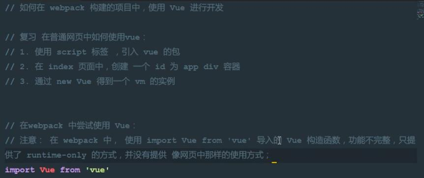
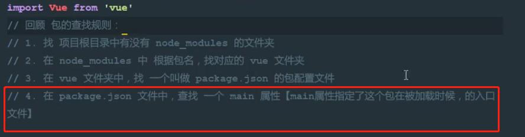
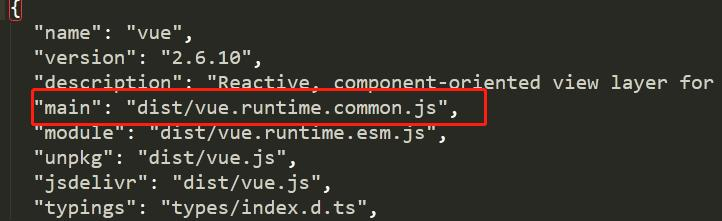

[img_bed]:https://raw.githubusercontent.com/MXDC/images_bed/master/img/

#### 使用

```javascript
// 直接在脚本中引用
<script src="./node_modules/vue/dist/vue.min.js"></script>

```

#### Vue实例

每个 Vue 应用都是通过用 `Vue` 函数创建一个新的 **Vue 实例**开始的：

```javascript
var vm = new Vue({
    el:'#id',// 视图模板的Id
    data:{// 数据对象
  		msg:"hello world"      
    }，
    methods:{
      show:function(msg){
                alert(msg+this.btnMsg)
            }
}
})
```

> Vue实例相当一个ViewAndModle。vm属性访问加`$`符号：`vm.$el`,`vm.$data`,数据访问直接vm.msg

#### 模板语法

##### v-text 和 v-html

<<<<<<< HEAD
* `{{mgs}}` : 绑定数据,只会替换自己的占位符，会转义输出 
=======
* `{{mgs}} `: 绑定数据,只会替换自己的占位符，会转义输出 
>>>>>>> 86b7659abece8e445f157d243c30ba0eb7b8b217

* `v-text = “msg” `: 绑定数据,会覆盖标签里面的内容，,会输出标签
* `v-html = "msg"`：会解析html标签

```html
<style>
    [v-cloak]{
        display: none;
    }
</style>

<div id="app" v-cloak>
     {{msg}}
</div>
<h4 v-text="msg">
</h4>
```

##### v-bind

v-bind是vue中用于绑定`属性`的指令，单向绑定

`v-bind:attribute='expr'`可以简写为`:attribute='expr'`

```html
<!-- v-bind 会把mytitle当成表达式 -->
<div id="app" v-bind:title='mytitle+"hello word" '></div>
<script>
	var vue = new Vue({
        el:'#app',
        data:{
            mytitle:'this is a title'
        }
    })
</script>
```

##### v-on和事件修饰符

v-on是vue中用来绑定事件的指令

`v-on:event='method(param)'`可以简写为`@evnet='method(param)'`

```html
<input id="btn" :value='btnMsg' v-on:click='show("hello word")'>
<script>
	var vue = new Vue({
        el:'btn',
        data:{
            btnMsg:'button'
        },
        methods:{
            show:function(msg){
                alert(msg+this.btnMsg)
            }
        }
    })
</script>
```

vue事件修饰符：

* event.stop 停止向上冒泡
* event.prevent 阻值默认行为
* event.catpure 实现捕获触发事件的机制(相对于冒泡触发)
* event.self 只有点击单前元素才会触发事件,不会阻止冒泡行为
* event.once 只触发一次函数

>事件修饰符可以串联,eg.evnet.self.once

##### 跑马灯实例

```html
<body>
  <div id="app">
      <input type="button" :value="start" @click='s'>
      <input type="button" :value="stop" @click='sp'>
      <h4>{{msg}}</h4>
  </div>
 <script src="./node_modules/vue/dist/vue.min.js"></script>
<script>
    new Vue({
        el:'#app',
        data:{
            start:'开始',
            stop:'结束',
            msg:'浪哩个啦浪哩个啦',
            intervalId:null
        },
        methods:{
            s(){
                this.intervalId=setInterval(()=>{
                    this.msg = this.msg.substring(1)+this.msg.substring(0,1)
                console.log(this.msg)
                },500)
                
            },
            sp(){
                clearInterval(this.intervalId)
            }
        }
    })
</script>
</body>
```

##### v-model双向数据绑定

v-model 只能用于表单元素中

```html
<input type="text" v-model:value = "msg"/>
<input type="text" v-model = "msg"/>
```

##### v-for指令

1. `<h v-for="item in list">{{item}}</h>`
2. 使用索引，第二个参数为索引`<h v-for="(item,i) in list">{{i}}--{{item}}</h>`
3. 遍历对象(值，键，索引)，`v-for="(val,key,index) in user"`
4. 遍历数值 ，`v-for ="i in 10"` 从1开始

```html
<h v-for="item in list">{{item}}</h>

<script>
   var vue = new Vue({
       el:'#app',
       data:{
        list:[1,2,4,5,6]
       },
   })
</script>
```

> 使用：key="",使选项唯一，保持对应关系，key为string/int

```html
<el-timeline-item
              v-for="item in this.$store.getters.records"
              class="list-item"
              :key="item.id"
              :timestamp="item.modifiedTime"
              placement="top"
            >
```


##### v-if和v-show

v-if每次都删除创建元素，v-show没有切换display


#### 在vue中使用样式-class四种

* 用v-bind绑定时，直接传递一个数组，`<div id="app" :class="['italic','red','thin']">`

```html
 <style>
    .red{
        color: red
    }
    .italic{
        font-style: italic
    }
    .thin{
        font-size: 200pt;
    }
    </style>
    
<div id="app" :class="['italic','red','thin']">
     {{msg}}
     <input type="text" v-model:value = "msg"/>
 </div>
```

* 在数组中使用三元表达式 `<div id="app" :class="['italic,flag?'thin':'red']">`

```html
 `<div id="app" :class="['italic,flag?'thin':'red']">
<script>
   var vue = new Vue({
       el:'#app',
       data:{
           msg:"hhahahah",
           flag:false
       },
       methods:null
   })
</script>
```

* 在数组中使用对象代替三元值`<div id="app" :class="['italic,{'red':falg}]"> ` 

* 直接使用对象` <div id="app" :class="{red:true,italic:true,thin:true}">`

  或`<div id="app" :class="classObject">`

  ```html
  <script>
     var vue = new Vue({
         el:'#app',
         data:{
             msg:"hhahahah",
             flag:true,
             classObject:{
                 red:true,
                 italic:true,
                 thin:true
             }
         },
         methods:null
     })
  </script>
  ```

  
<<<<<<< HEAD
在vue中使用内联样式-style四种
=======

#### 在vue中使用内联样式-style四种
>>>>>>> 86b7659abece8e445f157d243c30ba0eb7b8b217

* 直接在元素上使用:style="object"

  `<div id="app" :style="{color:'red','font-style':'italic'}">`

* 使用数组引用多个对象 `<div id="app" :style="[classObject1,classObject2]">`

  ```html
  <div id="app" :style="[classObject1,classObject2]"> 
  var vue = new Vue({
         el:'#app',
         data:{
             msg:"hhahahah",
             flag:true,
             classObject1:{
                 color:'red'
             },
             classObject2:{
                 'font-style':'italic'
             }
         },
     })
  </script>
  ```


<<<<<<< HEAD
在`{{}}`和`v-bind`中使用管道 `| `做过滤处理
=======
>>>>>>> 86b7659abece8e445f157d243c30ba0eb7b8b217

```html
<!-- in mustaches -->
{{ message | capitalize }}

<!-- in v-bind -->
<div v-bind:id="rawId | formatId"></div>
```

定义全局过滤器

```js

Vue.filter('capitalize', function (value) {
  if (!value) return ''
  value = value.toString()
  return value.charAt(0).toUpperCase() + value.slice(1)
})
```


过滤器可以接收多个参数

```javascript
{{ message | capitalize('arg1','arg2') }}

Vue.filter('capitalize', function (value,arg1,agr2) {
  if (!value) return ''
  value = value.toString()
  return value.charAt(0).toUpperCase() + value.slice(1)
})
```

#### vue-resource

vue-resource依赖vue,实现`get`,`post` ,`jsonp`请求

安装`cnpm i vue-resource`

#### vue组件

组件是ui界面角度,模块是代码角度，将某个功能模块定义成组件，要那部分功能就使用那部分组件。**组件是可复用的 Vue 实例**。通过`<组件名></组件名>`使用组件。


> `new Vue(options)`就是个根节点，`options`就是组件

生命周期：


##### 全局组件

***

##### 创建方式1-Vue.extend()

使用Vue.extend创建全局的组件对象，`Vue.component()`注册全局组件，在全局可用

```js
// 1.1定义使用Vue.extend定义一个组件
var comp = Vue.extend({
   		// 组件中包含模板元素,template
      template:'<h1>hello world</h1>'
  })
// 1.2注册组件
    Vue.component('myComp',comp);
    var v =new Vue({
        el:'#app'// 只有实例化vue对象控制的元素才能引用组件
    })
```

> 只有实例化vue对象后才能引用组件，在使用Vue.component定义组件时，组件名使用驼峰命名，引用组件时要用`-`连接

##### 创建方式2 

```js
<script>
    Vue.component('myComp',{
        template:'<h1>hello word</h2>'
    });
    var v =new Vue({
        el:'#app'
    })
</script>
```

> 组件模板`template`只能包含一个根元素

##### 创建方式3

在被控制的元素的外部使用`template`元素定义模板，通过id引用模板

```html
    <div id="app">
        <my-comp></my-comp>
    </div>
    <template id="templ">
        <div>
            hahhahaha
        </div>
    </template>
 <script src="./node_modules/vue/dist/vue.min.js"></script>
<script>
    Vue.component('myComp',{
        template:'#templ'
    });
    var v =new Vue({
        el:'#app'
    })
</script>
```


##### 局部组件

***

```javascript
new Vue({
    el:'',
    data:{},
    componens:{//定义实例内部组件用componets属性
        login:{//组件名
            template:'',
            
        }
    }
})
```


#### 组件对象的属性

```javascript
{
	template:'',//组件中的模板
	data:function(){return {} },//组件有自己的data,但必须一个函数，并返回数据对象，这样保证使用组件中的data对象都不一样
}
```

##### 组件中的data


> 组件中的data必须定义为function,方法必须返回一个对象


##### 组件切换

1. v-if 和v-else切换
2. `<component :is="expr"></component>`

```html
   <div id="app">
    <!-- vue 提供component组件 用来展示对应的模板组件 -->
    <!-- component为占位符 :is 属性用来指定要展示的组件名 -->
    <component :is="'comp1'"></component>
    </div>

<script>
    Vue.component('comp1',{
        template:'<h1>登录</h1>',
        
    });
    Vue.component('comp2',{
        template:'<h1>注册</h1>',
        
    });
    var v =new Vue({
        el:'#app',
        data:{
            list:[]
        }
    })
</script>
```


##### 父组件向子组件传值

父组件在引用子组件的时候通过属性绑定的方式(v-bind)传值

```html
 <div id="app">
  <!-- 通过v-bind绑定自定义属性pmsg到msg -->
  <!-- 自定义属性pmgs在props数组中定义才可以在子组件中使用 -->
    <com1 v-bind:pmsg="msg"></com1>
 </div>

<script>
  
    var v =new Vue({
        el:'#app',
        data:{
            msg:"hello world"
        },
       components:{
            
           com1:{
               template:'<h1>jjjj{{pmsg}}---{{cmsg}}</h1>',
            //    需要定义才能使用，只读
               props:['pmsg'],
               data() {
               return {
                   cmsg:"aaaaa"
               }
           },
           }
       }
    })
</script>
```

父组件向子组件传递方法

使用事件绑定机制 v-on:func = "parent_function"

子组件 通过this.$emit('func'，arg,..)调用父组件的函数

可以通过arg变相传参给子组件

#### vue-router

前端单页面通过hash(#)来切换页面的方式

##### [安装](https://router.vuejs.org/zh/installation.html)

```
npm install vue-router
```

*如果在一个模块化工程中使用它，必须要通过 Vue.use() 明确地安装路由功能：*

```javascript
import Vue from 'vue' 
import VueRouter from 'vue-router'  
Vue.use(VueRouter)  
```

使用和创建路由(使用script全局引用则不需Vue.use())

```javascript
Vue.use(VueRouter)
var router = new VueRouter({
    routes:[//路由匹配规则
        {path:'/',redirect:'/login'},//重定向
        {path:'/login',component:login}
    ]
})	
```

> component的属性值必须是一个组件模板对象，不能是组件的引用名称,重定向使用`redirect` 

##### 基本使用

创建完路由规则对象后，`要注册到vm实例对象`

```javascript
var vue = new Vue({
    el:'#app',
    data:{},
    router:router
})
```

注册完路由后，要在对应的元素上放在容器`<router-view></router-view>`

```
<div id="app">
  <!-- 路由出口 -->
  <!-- 路由匹配到的组件将渲染在这里 -->
  <!-- router-view提供的特殊占位符 -->
  <router-view></router-view>
 </div>
```

```html
 <!-- 使用 router-link 组件来导航. -->
 <!-- 通过传入 `to` 属性指定链接. -->
 <!-- <router-link> 默认会被渲染成一个 `<a>` 标签 -->
 <router-link to="/foo" tar="span">Go to Foo</router-link>
 <router-link to="/bar">Go to Bar</router-link>
```

##### 路由传参

1.


#### webpack

问题1：资源多，要发起多次请求

问题2：

> webpack能转化一些低级的es6语法，可以使用bable转化更高级的语法

#### webpack-dev-server

webpack-dev-server生成的bundle.js文件在服务器跟目录，且在内存里，没有生成本地文件
常用命令:

webpack-dev-server --open --port 3000  : 启动后自动打开,和设置端口

​                                      --contentBase path :服务器的根路径

​									  --hot :局部热更新

```json
"scripts": {
    "dev": "webpack-dev-server --open --port 3000 --contentBase src --hot"
  }
```


#### html-webpack-plugin

#### loader

webpack默认打包js文件，无法打包非js文件，如果要打包其他文件需要安装第三loader加载器，

如果要打包css要安装`style-loader`和`css-loader`，然后在webpack.config.js中新增module节点，module对象上有个rules数组，存放了第三方文件的匹配和处理规则

```js
module:{
  rules:[
    {test:/\.css$/,use:['style-loader','css-loader']}//从后往前调用loader
  ]
}
```

图片路径使用url-loader,url-loader内部依赖file-loader ` {test:/\.(jpg|png|jpeg|gif|bmp)/,use:'url-loader?limit=7834&name=[name].[ext]'}`如果引用的图片大于`limit`不会转化为base64(但会重新命名)，如果小于limit会转化为base64；`name=[name].[ext]`图片名称使用原理的名称。

#### 在webpack 构建的项目中使用Vue进行开发







> 使用import Vue from 'vue'导入的是 vue.runtime.common.js不是vue.js

使用`import Vue from '../node_modules/vue/dist/vue.js'`导入或使用`import Vue from 'vue'`然后在webpack.config.js中添加resolve配置

```javascript
module.exports = {
  entry: './src/main.js',
  output: {
    path: path.resolve(__dirname, 'dist'),
    filename: 'bundle.js'
  },
........
  resolve:{
    alias:{//修改要导入的vue模块路径
      'vue$':'vue/dist/vue.js'
    }
  }
};
```


****

:moon:在webpack导入.vue模板

```html
<template>
    ...
</template>
<script>
    ...
</script>
<style>
    ...
</style>
```


默认无法打包vue，需要导入相关loader`cnpm i vue-loader vue-template-compiler -D`

[https://vue-loader.vuejs.org/guide/#manual-setup](https://vue-loader.vuejs.org/guide/#manual-setup)

```javascript
// webpack.config.js
const VueLoaderPlugin = require('vue-loader/lib/plugin')

module.exports = {
  module: {
    rules: [
      // ... other rules
      {
        test: /\.vue$/,
        loader: 'vue-loader'
      }
    ]
  },
  plugins: [
    // make sure to include the plugin!
    new VueLoaderPlugin()
  ]
}
```

>**The plugin is required!** It is responsible for cloning any other rules you have defined and applying them to the corresponding language blocks in `.vue` files. For example, if you have a rule matching `/\.js$/`, it will be applied to `<script>` blocks in `.vue` files.

在webpack使用 render进行渲染

```javascript
import login from './login.vue'


var vue = new Vue({
    el:'#app',
    data:{
        msg:'this is a msg'
    },
    render:function(r){// render属性是一个函数，形参可以随便写
        return r(login)//返回的值会替换调'#app'这个容器
    }
})
```

#### export defalut 和export

1. 在模块中只允许export defalut 暴露一次
2. export defalut 暴露的成员可以使用任意变量接收
3. 在一个模块中可以同时使用export default和export
4. 使用export向外暴露的成员只能用`{}`来接收

#### vue在webpack中使用

